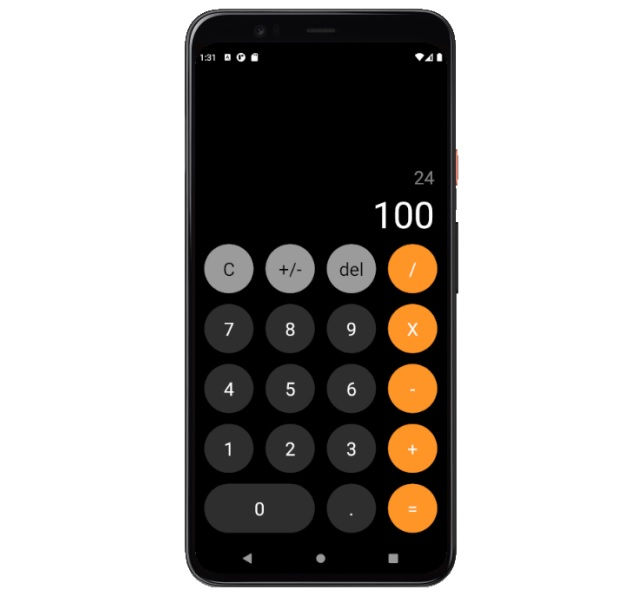

# CALCULATOR - REACT NATIVE (with TypeScript)

<br>
Aplicación de calculadora para android e ios basada en ReactNative con tipado estático en TypeScript.
<br>
<br>

## Funcionalidad

Dispone de las siguientes funcionalidades:
- Sumar
- Restar
- Multiplicar
- Dividir
- Resetear valores
- Eliminar último dígito marcado
- Operar números positivos y negativos
<br>
<br>
<hr>
<br>

### COMPONENTS:

- **ButtonCalc:** Botones de la calculadora.
<br>
<br>

### HOOKS:

- **useCalculator:** Custom hook con las funcionalidades de la calculadora.
<br>
<br>

### SCREENS:

- **CalculadoraScreen:** Ventana de la calculadora.
<br>
<br>

### THEME:

- **appTheme:** Estilos generales de la aplicación.
<br>
<br>
<hr>
<br>

### Tecnologías:

```React Native```<br>
```TypeScript```<br>
```Dev: React-Native-CLI, Node/Metro```
<br>
<br>


### Dependencias: 
<br>

**Dependencies:**
```
"react": "17.0.1"
"react-native": "0.64.1"
```

**devDependencies:**
```
"@babel/core": "^7.12.9"
"@babel/runtime": "^7.12.5"
"@react-native-community/eslint-config": "^2.0.0"
"@types/jest": "^26.0.23"
"@types/react-native": "^0.64.5"
"@types/react-test-renderer": "^16.9.2"
"babel-jest": "^26.6.3"
"eslint": "^7.14.0"
"jest": "^26.6.3"
"metro-react-native-babel-preset": "^0.64.0"
"react-test-renderer": "17.0.1"
"typescript": "^3.8.3"
```